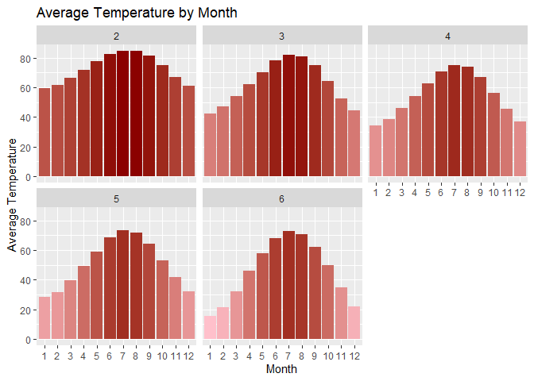
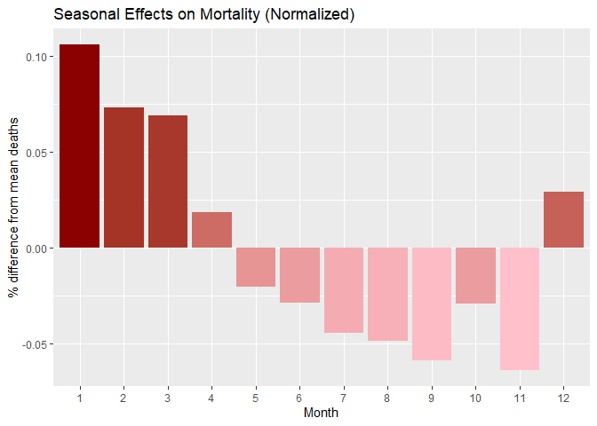
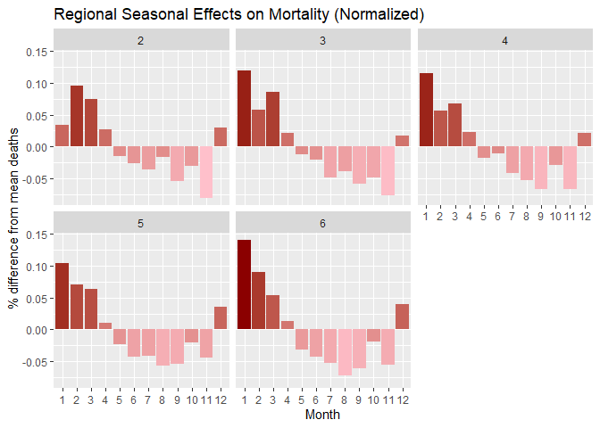
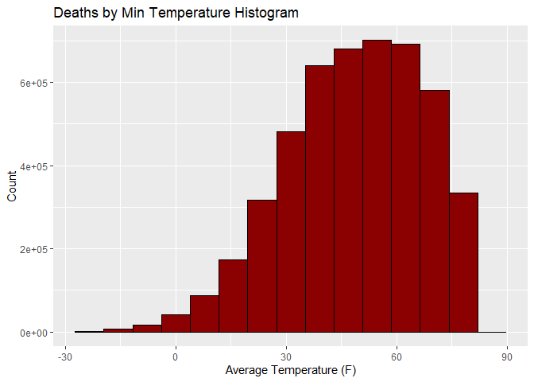
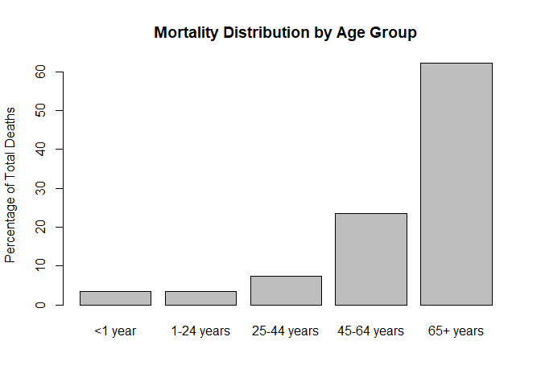
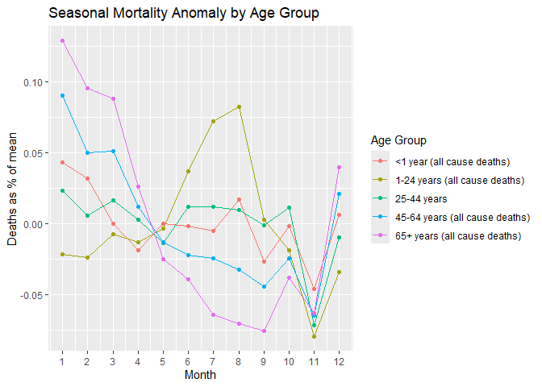

Analysis of the Effects of Weather on Mortality in Metropolitan Areas
================

Madhu Avula, Nick DeReus, Jacob Johnson, Brianna Norman

# This document will eventually contain the final report of this project. For now it is a place for thoughts and structuring

## Introduction

The weather has outstanding impacts on the daily lives of individuals.
It is common knowledge that extreme heat and cold as well as
precipitation, wind, and storms can be dangerous. We want to take those
into account but also attempt to demonstrate more banal long term
effects of seasons and weather.

This project seeks to research the weather’s impact on mortality rates
to better understand the necessity and impact of weather resilience as
well as the potential dangers of ongoing climate change.

We shall endeavor to answer the following questions:

1.  Are there seasonal trends in mortality rates? Do different regions
    experience these impacts differently?
2.  How much of an impact does temperature have on mortality? Do
    different regions experience these impacts differently?
3.  Are different age groups affected differently? What age groups are
    most at risk?
4.  Which kinds of weather events have the greatest impacts on
    mortality? (Extreme heat, cold, ice, flooding)
5.  Define which regions are most affected by certain types of weather?
    (Which most vulnerable to heat waves and extreme cold)
6.  Do each of the above trends hold when pnumonia deaths (flu seasons)
    are removed?

## Data

We had to unite multiple datasets to answer these question, one from the
CDC which contains weekly mortality data for a selection of 122 cities
accessed here:
<https://data.cdc.gov/dataset/Deaths-in-122-U-S-cities-1962-2016-122-Cities-Mort/mr8w-325u/about_data>
. The second dataset, accessed here
<https://www.ncdc.noaa.gov/cdo-web/search> contains daily weather
summaries from weather stations from the NOAA, the weather station which
best represents a city from our mortality dataset has to be linked up
with their city and the rest could be dropped.

### Data Values and Structure

#### Deaths in 122 US Cities

- Year -
- WEEK -
- Week Ending Date -
- State -
- City -
- Pneumonia.and.Influenza.Deaths
- All.Deaths -
- \<1 year (all cause deaths) -
- 1-24 years (all cause deaths) -
- 25-44 years (all cause deaths) -
- 45-64 years (all cause deaths) -
- 65+ years (all cause deaths) -

#### NOAA CDO Daily Summaries

This dataset is quite detailed, but we’re mostly interested in three
variables:

1.  TAVG - Average temperature.
2.  TMAX - Maximum Temperature.
3.  TMIN - Minimum Temperature.

- STATION - Identifying weather station code
- NAME - Weather station name
- DATE - Date of summary
- WT03 - Thunder
- WT04 - Ice pellets, sleet, snow pellets, or small hail”
- PRCP - Precipitation
- WT05 - Hail (may include small hail)
- WSFM - Fastest mile wind speed
- WT06 - Glaze or rime
- WT07 - Dust, volcanic ash, blowing dust, blowing sand, or blowing
  obstruction
- WT08 - Smoke or haze
- SNWD - Snow depth
- WT09 - Blowing or drifting snow
- WDF1 - Direction of fastest 1-minute wind
- WDF2 - Direction of fastest 2-minute wind
- WDF5 - Direction of fastest 5-second wind
- WT10 - Tornado, waterspout, or funnel cloud”
- PGTM - Peak gust time
- WT11 - High or damaging winds
- TMAX - Maximum temperature
- WT13 - Mist
- FRGT - Top of frozen ground layer
- WSF2 - Fastest 2-minute wind speed
- FMTM - Time of fastest mile or fastest 1-minute wind
- ACMH - Average cloudiness midnight to midnight from manual
  observations
- WSF5 - Fastest 5-second wind speed
- SNOW - Snowfall
- WDFG - Direction of peak wind gust
- WT14 - Drizzle
- ACSH - Average cloudiness sunrise to sunset from manual observations
- WT15 - Freezing drizzle
- WT16 - Rain (may include freezing rain, drizzle, and freezing
  drizzle)”
- WT17 - Freezing rain
- WT18 - Snow, snow pellets, snow grains, or ice crystals
- WT19 - Unknown source of precipitation
- WSF1 - Fastest 1-minute wind speed
- AWND - Average wind speed
- WT21 - Ground fog
- WSFG - Peak gust wind speed
- WT22 - Ice fog or freezing fog
- WT01 - Fog, ice fog, or freezing fog (may include heavy fog)
- WESD - Water equivalent of snow on the ground
- WT02 - Heavy fog or heaving freezing fog (not always distinguished
  from fog)
- PSUN - Daily percent of possible sunshine for the period
- TAVG - Average Temperature.
- TMIN - Minimum temperature
- WDFM - Fastest mile wind direction
- TSUN - Total sunshine for the period

#### Department of Energy Climate Regions

The US Department of Energy released a map breaking the US into regions
at the county level based upon the climate control needs of people in
different areas of the nation. Each region is numbered from 1-8, 1 being
the hottest and 8 being the coolest. This mapping was selected to help
break up the larger dataset by climate region for selection and further
comparison.

<figure>

<figcaption aria-hidden="true">alt text</figcaption>
</figure>

### Data Preperation

Our multiple datasets had to be combined. Due to constraints with the
NOAA data we limited the cities from the 122 in the Mortality dataset to
15 total, 3 from each of the 5 regions from the US Department of Energy
map containing the grand majority of the population, regions 2-6.

Region 2 - Houston, TX - Miami, FL - Phoenix, AZ

Region 3 - Little Rock, AR - Memphis, TN - Fresno, CA

Region 4 - Evansville, IN - Seattle, WA - Wichita, KS

Region 5 - Indianapolis, IN - Colorado Springs, CO - Boston, MA

Region 6 - Minneapolis, MN - Saint Paul, MN - Milwaukee, WI

These cities then had to be paired up with the weather data, which is
tied to specific weather station numbers rather than cities. A table was
made up manually containing the information for each city.

| city             | state | station     | region |
|------------------|-------|-------------|--------|
| Houston          | TX    | USW00012918 | 2      |
| Miami            | FL    | USW00012839 | 2      |
| Phoenix          | AZ    | USC00029464 | 2      |
| Little Rock      | AR    | USW00003930 | 3      |
| Memphis          | TN    | USW00013893 | 3      |
| Fresno           | CA    | USW00093193 | 3      |
| Evansville       | IN    | USW00093817 | 4      |
| Seattle          | WA    | USW00024233 | 4      |
| Wichita          | KS    | USW00003928 | 4      |
| Indianapolis     | IN    | USW00093819 | 5      |
| Colorado Springs | CO    | USW00093037 | 5      |
| Boston           | MA    | USW00014739 | 5      |
| Minneapolis      | MN    | USW00014922 | 6      |
| Saint Paul       | MN    | USW00014922 | 6      |
| Milwaukee        | WI    | USW00014839 | 6      |

With that prepared, we clean our data:

    # Imports:
    mortality <- read_csv("Deaths_in_122_U.S._cities_-_1962-2016._122_Cities_Mortality_Reporting_System_20241019.csv")
    all_station_weather <- read_csv("Station_weather_data.csv")
    City_station_numbers <- read_csv("City_station_numbers.csv")

    # Clean the table containing the manually entered city station data which contained empty rows
    City_station_numbers <- City_station_numbers %>% drop_na(city)

    # Rename columns in the weather dataframe
    all_station_weather <- all_station_weather %>% rename_at('city', ~'City')
    all_station_weather <- all_station_weather %>% rename_at('state', ~'State')

Prepare and aggregate weather data, the weather data is daily while the
mortality data is weekly.

    # Expand Date Data
    weather_data_prepped <- all_station_weather2 %>% 
     
      mutate( 
        DATE = mdy(DATE),
        Week = week(DATE),
        Month = month(DATE),
        Year = year(DATE),
    ) %>% 
      
      group_by(STATION, Year, Week)

    # Select Values to be Aggregated
    TAVG_weekly <- weather_data_prepped %>% 
      
      group_by(region, State, City, STATION, Year, Month, Week) %>%
      
      summarize(
        TAVG = mean(TAVG),
        TMAX_Max = max(TMAX),
        TMAX_Mean = mean(TMAX),
        TMIN_Min = min(TMIN),
        TMIN_Mean = mean(TMIN),
        TSUN = mean(TSUN),
        WSFG_Max = max(WSFG),
        WSFG_Mean = mean(WSFG),
        AWND = mean(AWND),
        PRCP_Mean = mean(PRCP),
        PRCP_Sum = sum(PRCP),
        PRCP_Max = max(PRCP),
        SNOW_Mean = mean(SNOW),
        SNOW_Sum = sum(SNOW),
        SNWD_Mean = mean(SNWD),
        SNWD_Max = mean(SNWD),
      )

We then filter and combine our dataframes

    # Filter the mortality in 122 cities data by city 
    mortality_small <- mortality %>% filter(City %in% City_station_numbers$city)

    # Merge all_station_weather with city_station_data, adding city and region information to the weather data.
    all_station_weather2 <- merge(all_station_weather, mutate(City_station_numbers, STATION = station), by = 'STATION')

    # Mutate mortality data, renaming region and adding detailed date information we can use to filter.
    mortality_small <- mortality_small %>% mutate(
      Date = mdy(`Week Ending Date`),
      Week = week(Date),
      Month = month(Date),
      Year = year(Date),
    ) %>% rename_at('REGION', ~'CDC_Region')

Finally combine weather and mortality data

    wm_combined <- merge(mortality_small, TAVG_weekly)

### Final Data Shape

## Results

### Basic Observations of from the Dataset

#### Average Annual Temperature Over Time

We find that the locations in our dataset have seen a progressive
increase in average temperatures over the time since the beginning of
the time period in 1962. We can’t use this to prove global warming
necessarily because these locations are all likely subject to the Heat
Island effect, but the experience of people living in these locations is
one of increasing average temperature.

<!-- -->

When charted by region, we can see that this increase in average
temperatures is felt across all climate regions, but is most obvious in
Region 6, which is the coolest region.

    ## `summarise()` has grouped output by 'region'. You can override using the
    ## `.groups` argument.

<!-- -->

#### Seasonality of Temperature

<!-- -->

    ## `summarise()` has grouped output by 'region'. You can override using the
    ## `.groups` argument.

<!-- -->

#### Distribution of Daily Average Temperatures

<!-- -->

### Seasonal trends in mortality rates

After normalizing death counts across our regions we find that death
rates across our sample set are significantly higher on avg during the
winter season and lower in summer months.

<!-- -->

When we break down the data regionally we can see that colder regions
have more highly seasonal effects on mortality, but even very warm
regions suffer higher mortality in the winter months.

We hypothesize that there are behavioral factors behind the increased
winter mortality, but we aren’t able to explore that here. At the very
least we can assume that weather cannot be the only, or even the most
major, factor behind these findings.

<!-- -->

### Correlation between temperature and Mortality

#### The most deaths occurred during times where the average minimum temperature was between 45 and 60, which is likely the minimum from the days with high maximum temperatures. It is expected that colder regions will see higher mortality counts in lower temperatures when observed outside of the other regions.

#### Plot of the mean of the minimum monthly temperature plotted against the total deaths occurring at those temperatures

    ## Warning: Removed 145 rows containing non-finite outside the scale range
    ## (`stat_bin()`).

<!-- -->

#### Region 2 sees the highest death counts at maximum temperatures near 90, with death counts sharply increasing as the max temperature approaches that value. This region’s mortality rates do not seem as affected by temperatures below 35, likely due to a generally higher climate and not seeing temperatures that low.

#### Region 6 confirms the earlier held suspicion of a colder climate holding a higher mortality rate at lower temperatures than that of higher climates. This region has two mortality rate spikes: One where the max temperature approaches 75, and another where it is close to 30. However, the mortality rate seems to be fairly consistent at minimum temperatures between 35 and 60 in region 6

Plot of the mean of the maximum monthly temperature plotted against the
total deaths occurring at those temperatures, grouped by Region

    ## Warning: Removed 142 rows containing non-finite outside the scale range
    ## (`stat_bin()`).

<!-- -->

Plot of the mean of the minimum monthly temperature plotted against the
total deaths occurring at those temperatures

    ## Warning: Removed 145 rows containing non-finite outside the scale range
    ## (`stat_bin()`).

<!-- -->

### Differences in effects by age group

<!-- -->

### Effects of Seasonality by Age Group

    ## Warning: Using an external vector in selections was deprecated in tidyselect 1.1.0.
    ## ℹ Please use `all_of()` or `any_of()` instead.
    ##   # Was:
    ##   data %>% select(age_groups)
    ## 
    ##   # Now:
    ##   data %>% select(all_of(age_groups))
    ## 
    ## See <https://tidyselect.r-lib.org/reference/faq-external-vector.html>.
    ## This warning is displayed once every 8 hours.
    ## Call `lifecycle::last_lifecycle_warnings()` to see where this warning was
    ## generated.

<!-- -->

### The effect of various weather events on mortality

#### Regional Effects

### Relative Vulnerability to Weather Events by Region

### Controlling for Flu season

## Conclusion

## References

“Deaths in 122 US Cities, 1962-2016”, CDC,
<https://data.cdc.gov/dataset/Deaths-in-122-U-S-cities-1962-2016-122-Cities-Mort/mr8w-325u/about_data>

Weather station daily summaries, NOAA,
<https://www.ncdc.noaa.gov/cdo-web/search>
